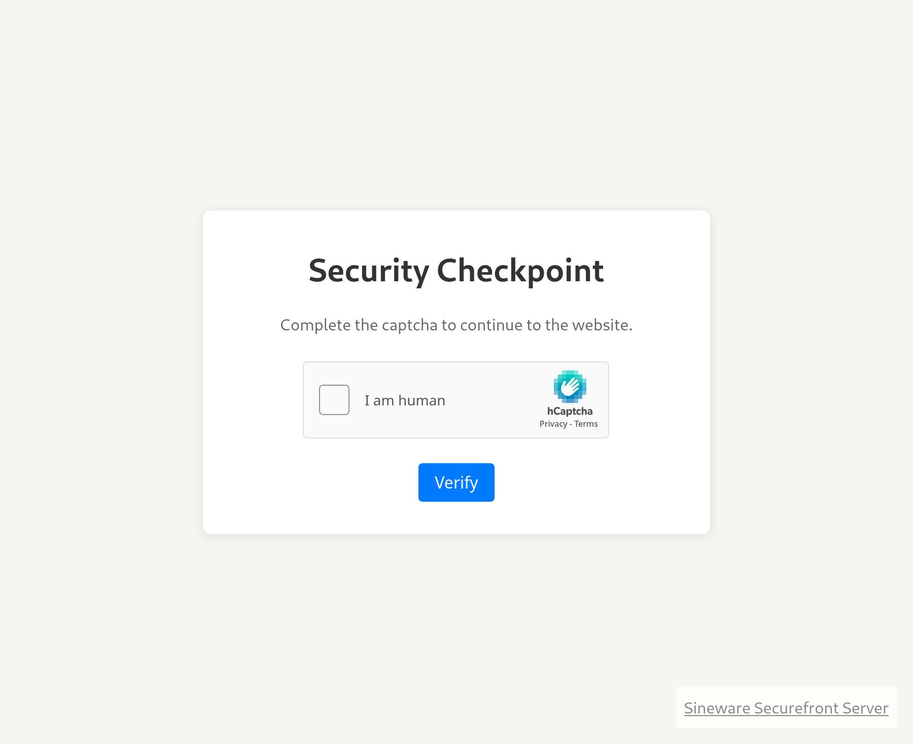

# Sineware Securefront
## Open Source, Self Hosted Security Gateway
A reverse proxy with websocket support that helps monitor and secure backend resources, written for Deno.

## Features
- CAPTCHA gating (displays a page with a captcha before reverse proxying to the backend)
- Automatic TLS certificate generation and termination using acme.sh (zerossl) and Deno's rustls implementation
- Apache-style logging with tcp syslog support (ex. to Elasticsearch/Opensearch)



## Installation
Docker is the only supported installation method. Copy the docker-compose.yml file and securefront.config.toml files to a directory, and additionally create a `tls` directory. The securefront.config.toml file should be edited to reflect the desired configuration. 
```bash
wget https://raw.githubusercontent.com/sineware/securefront/main/docker-compose.yml
wget https://raw.githubusercontent.com/sineware/securefront/main/securefront.config.toml
mkdir -pv tls
docker compose up
```

## Configuration
`securefront.config.toml` is the configuration file for Securefront. The default configuration file should be relatively self-explanatory.

- `port, tls_port, and hostname` should be left as is (unless you are attempting to use SF outside of the supported container)
- `captcha_jwt_secret` should be a long, secure random string used to sign the JWTs for the captcha page (use a command like `openssl rand -base64 64` to generate a secure secret)
- `hcaptcha_*` are the keys for the hCaptcha service.
- Options under `[tls]` are for the automatic TLS cert generation feature. If disable, Securefront will listen on http only.
- Likewise `[tls_manual]` is to bring your own cert. Only tls or tls_manual should be enabled, not both.
- Each `[[proxy]]` entry defines a reverse proxy configuration.
    - `host` and `url` define the incoming request path to match (ex. if `host=sineware.ca`, then all requests to sineware.ca/* will match, if you addtionally specify `url=/api`, then only requests to sineware.ca/api/* will match). 
    - `proxy_url` is the backend URL to proxy to. Requests will have the Host header match the incoming request (aka. `host=`). Howevever, responses are not rewritten.
    - `websocket` is a bool which enables websocket support for this route.
    - `captcha` is a bool which enables the captcha guard page for this route.
    - `captcha_expiry` is the time in minutes before the JWT expires and requires the user to complete the captcha again.

## License
Sineware Securefront is licensed under the GNU AGPL v3.0 license. See the LICENSE file for more information.